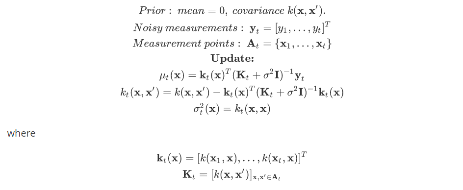

# Level Set Estimation

### 1.Background

Given a function *f : D* --> *R*, and a threshold level *h*, the **level set estimation (LSE)** problem is defined as the problem of classifying every point **x** in *D* into a superlevel set *H* and a sublevel set *L*.

We consider the strictly sequential setting. At each step *t*, a point **x** is selected and measured. The noisy measurement is

The function *f* is modeled as a sample from a Gaussian Process (GP). With each measurement we can update the GP in an online way.

### 2.Algorithms and Experiments

#### 2.1.Baseline

The baseline is proposed by [1]. According to the posterior GP,  a confidence region *C* is defined below

And an acquisition function is defined to choose the next measurement point.

Also, the algorithm maintains superlevel set *H*, sublevel set *L* and unclassified set *U*. In each iteration, it updates the GP parameters and computes confidence regions for each point. Then *H, L, U* are updated. Finally a new point is measured according to an acquisition function *a*.

When we use *Q* rather than *C* in the acquisition function, it becomes

this is *straddle* rule proposed by [2]. It achieves trade-off between **exploration** and **exploitation**. The first item prefers points with higher variance which means that these regions are seldom measured and we need to explore these regions. The second item prefers exploiting points near the threshold. A hyperparameter controls the trade-off.

#### 2.2. Experiments of baseline

We use the **2D-sinusoidal** function to perform experiments.

Firstly, we did T=100 meaurements and modified $\beta$. The results show that higher $\beta$ causes scattered superlevel set *H* and sublevel set *L*.

***Red-H, Dark Red-U, Black-L***

Then we did T=1000 measurements and got F1-score 0.874. (Precision=1.0, Recall=0.777) 

***Left: Level sets, Right: Position of measurement points***

#### 2.3.ConnectLSE

We improved baseline and proposed level set estimation based on connectivity between each level set. The name is **ConnectLSE**. This algorithm improves the acquisition function.

The first item is variance and the second item is about connectivity. The connectivity item prefers to choose unclassified points that have more classified points around themselves. In this way, the size of *L, H* can increase more quickly. We hope that it can improve the efficiency and get larger classified set with less measurements.

***T=100, ConnectLSE got larger classified sets***

***T=1000, ConnectLSE got better F1-score. LSE and ConnectLSE choose different measurement points.***

### 3.References

[1] A. Gotovos, N. Casati, G. Hitz, and A. Krause, “Active learning for level set estimation,” in
Int. Joint. Conf. Art. Intel., 2013.

[2] Brent Bryan, Jeff Schneider, Robert Nichol, Christopher Miller, Christopher Genovese, and Larry Wasserman. Active learning for identifying function threshold boundaries. In Neural Information Processing Systems (NIPS), 2005.

