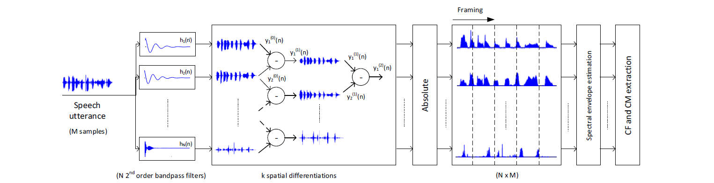

# Replay Attack Detection

In this project, we focus on replay attack detection. This technology is useful for anti-spoofing systems in speaker verification. Some research demonstrates that speaker verification systems are vulnerable to fake speech including synthetic speech,  converted speech and replay. Among all kinds of fake speech attack, replay is easy to be conducted and diffcult to be discriminated. Therefore, we would like to explore the way to detect replay attack.

## 1.Methods

#### 1.1.Features

We follow [1] to extract acoustic features.  [1] proposed two features: centroid frequency (CF) and centroid magnitude (CM). 

Firstly, we use **C** 2*nd* IIR bandpass filters

Then we do **k** differentiation between adjacent filters then we can get higher order filters. Finally, we apply STFT on each output and use spectrograms to compute features.

**centroid frequency (CF)**

**centroid magnitude (CM)**

In our experiments, we use **CF** as features. we also use constant Q cepstral coefficients (CQCC). Besides, we calculate differentiation of features as well.

We set batch size = 16 and pad all utterances to the max length. During STFT we use 20 *ms* Hamming winfow with 10 *ms* overlap.

#### 1.2.Models

We use **1D convolution + MaxPool** networks to classify features.  The input is a tensor with dimension ***N·C·T***. N is batch size, C is the number of bandpass filters after differentiation, T is total number of frames after STFT.

Also, we use ReLU as activation function and we apply batch normalization before activation. In training, dropout is applied with 0.2 dropout rate as well. 

After Conv1d modules, several linear layers are applied and we finally get a sigmoid output representing the probability that the utterance is real speech.

## 2.Experiments

#### 2.1.Datasets

**ASVspoof2017 [2] V2.0**

| Subset      | \# Real Utterances | \# Fake Utterances |
| ----------- | ------------------ | ------------------ |
| Training    | 1508               | 1508               |
| Development | 760                | 760                |
| Evaluation  | 1298               | 12008              |

Replay attack and multiple recording conditions. 

In training and dev subset, the contents of each pair (1 real + 1 fake utterance) are the same. In evaluation subset, there are some recording conditions that do not exist in training and dev subset. 

#### 2.2.Results

| Methods    | Training Accuracy | EER    |
| ---------- | ----------------- | ------ |
| CNN+CQCC   | 84.16%            | 23.25% |
| CNN+CQCC+Δ | 86.23%            | 22.88% |
| CNN+CF     | 94.17%            | 18.21% |
| CNN+CF+Δ   | 93.48%            | 18.83% |

##  3.References

[1] B. Wickramasinghe, E. Ambikairajah, J. Epps, V. Sethu, and H.Li, ‘Auditory Inspired Spatial Differentiation for Replay Spoofing Attack Detection,’ Proc. ICASSP 2019, pp. 6011- 6015, 2019. 

[2] Tomi Kinnunen, Md Sahidullah, Hector Delgado, Massimiliano Todisco, Nicholas Evans, Junichi Yamagishi, and Kong Aik Lee, “The asvspoof 2017 challenge: Assessing the limits of replay spoofing attack detection,” 2017.