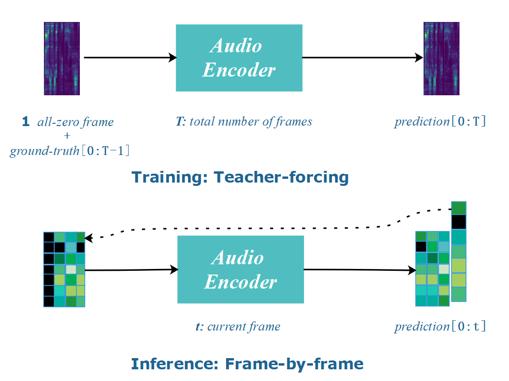
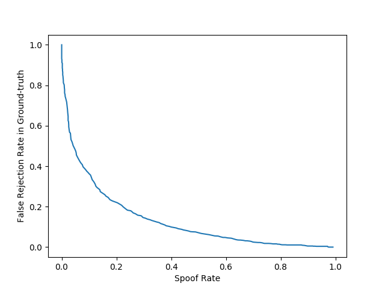

# Spoofing Effects of GAN-based Synthetic Speech on Speaker Verification Systems

This project does research on spoofing effects of synthetic speech on speaker verification (SV) systems in black-box condition. We utilize a deep convolutional text-to-speech (TTS) model trained with generative adversarial networks (GAN) and speaker embeddings extracted by Deep Speaker to generate multi-speaker speech. Then we test **i-vectors** and **Google’s GE2E** with mixture of real speech and synthetic speech. In addition, we also do research on spoofing effects on anti-spoofing systems in both black-box condition and white-box condition. The results demonstrate that **speaker verification systems are not safe when spoofed by synthetic speech.** Even if with anti-spoofing systems as gates, **speaker verification systems have the potential to get spoofed as anti-spoofing systems fail when their structures are completely or partly disclosed.**

## 1.Text-to-speech Model

We basically follow [1] which proposed an efficient TTS model only consisting of 1D convolutional layers. The original work is for single speaker TTS and we adapt it for multi-speaker TTS with the assistance of speaker embeddings extracted by **Deep Speaker** [2] implementation on github.  It contains two sub-models: Text2Mel and SSRN.

### 1.1.Text2Mel

Text2Mel converts text representations into reduced melspectrograms. It combines information from texts, audio signals and speakers and it consists of three parts: text encoder, audio encoder and audio decoder.

**Text encoder** accepts text embeddings as inputs. The embeddings are obtained from a trainable lookup table in which each row represents the embedding for each character in the vocabulary. The outputs of text encoder are two tensors representing text information.

**Audio encoder** has two input branches. One accepts reduced melspectrograms and the other accepts speaker embeddings as inputs. The two branches are added together and then processed by subsequent layers. The final output is a tensor representing audio and speaker information.

**Audio decoder** processes all previous information and predicts reduced spectrograms.

#### Attention Mechanism

We need to align texts and acoustic features. We can get an attention tensor **A** after text encoder and audio encoder. Because in the TTS task we would like to utter every character one after another, we should constrain **A** to be almost diagonal.

### 1.2.SSRN

SSRN (Spectrogram Super Resolution Networks) performs super resolution along time and frequency axes. It accepts reduced melspectrograms as inputs and the outputs are linear spectrograms.

### 1.3.Criteria

#### Text2Mel

where

Suppose the sentence has N characters and T frames and current positions are n, t. This means that penal effects rise with the increasing distance from diagonal.

#### SSRN

**Y** denotes predicted spectrograms and **S** denotes corresponding ground-truth.

### 1.4.Training and Inference

There are several differences in training stage and inference stage. In training we have ground-truth texts and spectrograms while in inference we only have texts. So in training we use teacher-forcing and in inference we we have to generate spectrograms frame by frame. Once spectrograms are generated we put the last frame after the previous inputs and compose the current inputs until we reach the last character or the max frame length.

## 2.Experiments

### 2.1.Datasets

##### **VCTK-Corpus**  

This corpus contains 109 English speakers and each speaker has around 400 utterances (~0.5 hour). We eliminate Speaker p315 for the absence of its texts.

##### ASVSpoof2019, Logical Access

| Subset             | \# Male spks | \# Female spks | \# Real utts | \# Fake utts |
| ------------------ | ------------ | -------------- | ------------ | ------------ |
| Training           | 8            | 12             | 2580         | 22800        |
| Dev(used for test) | 8            | 12             | 2548         | 22296        |

### 2.2.Spoofing Effects on Speaker Verification Systems

#### Experiment Design

We choose 3 models trained with different iterations:

| Model | Text2Mel iterations | SSRN iterations |
| ----- | ------------------- | --------------- |
| M1    | 500k                | 300k            |
| M2    | 700k                | 500k            |
| M3    | 1000k               | 800k            |

We also have 3 different speaker allocation schemes:

| Scheme | \# Speaker in training set | \# Speaker in test set |
| ------ | -------------------------- | ---------------------- |
| S1     | 42                         | 66                     |
| S2     | 60                         | 48                     |
| S3     | 88                         | 20                     |

In training we use real speech in training set. In test, we use real speech in test set for enrollment and we mix real speech (50%) and synthetic speech (50%) to perform evaluation.

We have 3 evaluation metrics:

| Metric | Description                                                  | Abbr. |
| ------ | ------------------------------------------------------------ | ----- |
| p1     | Equal error rate.                                            | EER   |
| p2     | Spoof rate (True positive in synthetic speech) at EER's threshold. | SR    |
| p3     | Practical spoof rate: spoof rate at the threshold of original EER which is computed with an evaluation set without synthetic speech. This is meaningful as SV system users probably set the threshold at the one they tuned with real speech. | PSR   |

#### i-vectors results

|        | **M1-p1** | **M1-p2** | **M1-p3** | M2-p1     | M2-p2      | M2-p3  | M3-p1 | M3-p2  | M3-p3      |
| ------ | --------- | --------- | --------- | --------- | ---------- | ------ | ----- | ------ | ---------- |
| **S1** | 9.70%     | 80.98%    | 42.12%    | 7.16%     | 86.67%     | 70.15% | 6.59% | 87.80% | **74.47%** |
| **S2** | 10.16%    | 79.79%    | 42.40%    | 6.30%     | 88.13%     | 72.08% | 6.20% | 88.02% | 66.98%     |
| **S3** | 11.38%    | 77.25%    | 26%       | **5.25%** | **89.25%** | 41%    | 6.50% | 87.25% | 57%        |

#### Google's GE2E results

|        | M1-p1  | M1-p2  | M1-p3  | M2-p1      | M2-p2      | M2-p3      | M3-p1  | M3-p2  | M3-p3  |
| ------ | ------ | ------ | ------ | ---------- | ---------- | ---------- | ------ | ------ | ------ |
| **S1** | 17.62% | 79.11% | 57.90% | 16.79%     | 82.23%     | 62.39%     | 15.95% | 82.48% | 69.80% |
| **S2** | 16.91% | 82.76% | 77.36% | **15.47%** | **84.81%** | **80.20%** | 17.64% | 83.88% | 72.48% |
| **S3** | 17.96% | 78.95% | 60.69% | 15.87%     | 82.43%     | 65.07%     | 17.71% | 81.08% | 69.16% |

we also plot the curve between spoof rate and false rejection rate in real speech. The illustrations below show that the curves are far from the origin so our synthetic speech has significant spoofing effects on speaker verification systems. 

#### i-vectors curve (SR vs. FRR within real speech)

#### Google's GE2E curve (SR vs. FRR within real speech)

### 2.3.Spoofing Effects on Anti-spoofing Systems

#### Black-box condition

As we synthesize speech with deep learning model, we choose a GMM anti-spoofing system with Linear Frequency Cepstral Coefficients (LFCC) features. The anti-spoofing system is trained by ASVspoof2019 dataset and tested by two test sets.

| Test Set | Description                                                  | Result             |
| -------- | ------------------------------------------------------------ | ------------------ |
| **TS1**  | mixture of real speech and our synthetic speech              | EER 3.74%          |
| **TS2**  | mixture of real speech and synthetic speech from [3], [4], [5], [6], [7] | EER less than 0.5% |

The results show that anti-spoofing systems can discriminate synthetic speech with very few mistakes in black-box condition.

#### White-box condition

We choose two variants **V1** , **V2** of the discriminator that we use in the GAN training as the anti-spoofing system. Each variant has similar structures to the original discriminator.

| Model Variant | EER    |
| ------------- | ------ |
| **V1**        | 42.56% |
| **V2**        | 36.21% |

## 3.References

[1] Hideyuki Tachibana, Katsuya Uenoyama, and Shunsuke Aihara, “Efficiently trainable text-to-speech system based on deep convolutional networks with guided attention,” in 2018 IEEE International Conference on Acoustics, Speech and Signal Processing (ICASSP). IEEE, 2018, pp. 4784–4788.

[2] Chao Li, Xiaokong Ma, Bing Jiang, Xiangang Li, Xuewei Zhang, Xiao Liu, Ying Cao, Ajay Kannan, and Zhenyao Zhu, “Deep speaker: an end-to-end neural speaker embedding system,” CoRR, vol. abs/1705.02304, 2017.

[3] Yuxuan Wang, RJ Skerry-Ryan, Daisy Stanton, Yonghui Wu, Ron J Weiss, Navdeep Jaitly, Zongheng Yang, Ying Xiao, Zhifeng Chen, Samy Bengio, et al., “Tacotron: Towards end-to-end speech synthesis,” arXiv preprint arXiv:1703.10135, 2017.

[4] Jonathan Shen, Ruoming Pang, Ron J Weiss, Mike Schuster, Navdeep Jaitly, Zongheng Yang, Zhifeng Chen, Yu Zhang, Yuxuan Wang, Rj Skerrv-Ryan, et al., “Natural tts synthesis by conditioning wavenet on mel spectrogram predictions,” in 2018 IEEE International Conference on Acoustics, Speech and Signal Processing (ICASSP). IEEE, 2018, pp. 4779–4783.

[5] Nal Kalchbrenner, Erich Elsen, Karen Simonyan, Seb Noury, Norman Casagrande, Edward Lockhart, Florian Stim-berg, Aaron van den Oord, Sander Dieleman, and Koray Kavukcuoglu, “Efficient neural audio synthesis,” arXiv preprint arXiv:1802.08435, 2018.

[6] Yu-An Chung, Yuxuan Wang, Wei-Ning Hsu, Yu Zhang, and RJ Skerry-Ryan, “Semi-supervised training for improving data efficiency in end-to-end speech synthesis,” in ICASSP 2019- 2019 IEEE International Conference on Acoustics, Speech and Signal Processing (ICASSP). IEEE, 2019, pp. 6940–6944.

[7] Yu Zhang, Ron J Weiss, Heiga Zen, Yonghui Wu, Zhifeng Chen, RJ Skerry-Ryan, Ye Jia, Andrew Rosenberg, and Bhuvana Ramabhadran, “Learning to speak fluently in a foreign language: Multilingual speech synthesis and cross-language voice cloning,” arXiv preprint arXiv:1907.04448, 2019.