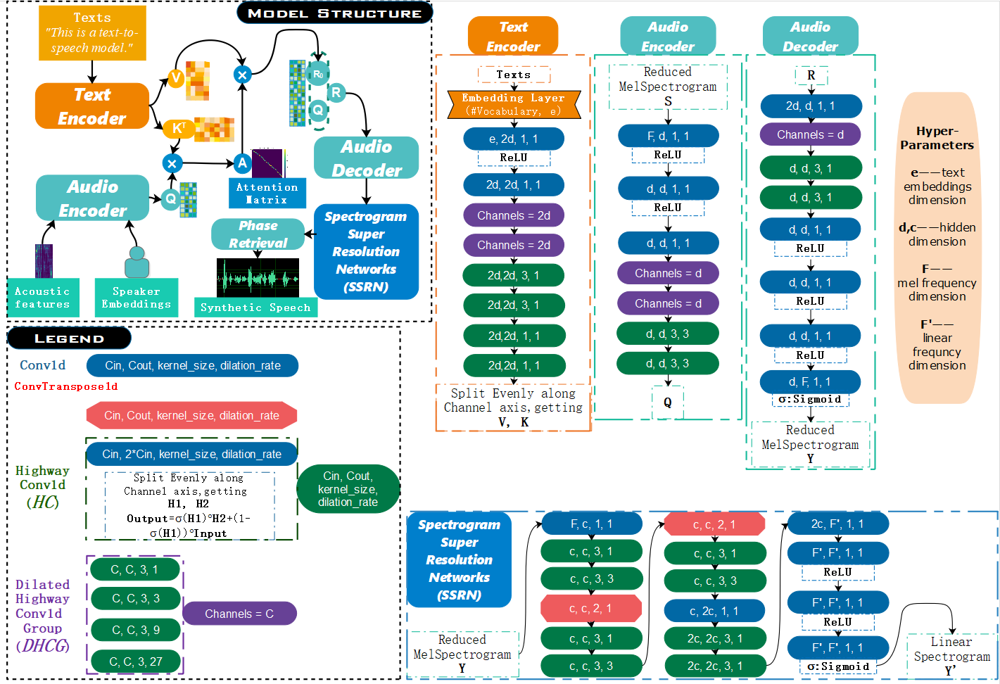

# Spoofing Effects of GAN-based Synthetic Speech on Speaker Verification Systems

This project does research on spoofing effects of synthetic speech on speaker verification (SV) systems in black-box condition. We utilize a deep convolutional text-to-speech (TTS) model trained with generative adversarial networks (GAN) and speaker embeddings extracted by Deep Speaker to generate multi-speaker speech. Then we test **i-vectors** and **Google’s GE2E** with mixture of real speech and synthetic speech. In addition, we also do research on spoofing effects on anti-spoofing systems in both black-box condition and white-box condition. The results demonstrate that **speaker verification systems are not safe when spoofed by synthetic speech.** Even if with anti-spoofing systems as gates, **speaker verification systems have the potential to get spoofed as anti-spoofing systems fail when their structures are completely or partly disclosed.**

## Text-to-speech Model

We basically follow [1] which proposed an efficient TTS model only consisting of 1D convolutional layers. The original work is for single speaker TTS and we adapt it for multi-speaker TTS with the assistance of speaker embeddings extracted by **Deep Speaker** [2] implementation on github.  The model contains two sub-models: **Text2Mel** and **SSRN**.

#### Text2Mel

This sub-model converts texts into reduced mel-spectrograms. It combines information from texts, audio signals and speakers and it consists of three parts: text encoder, audio encoder and audio decoder. 

## Experiments

### Datasets

**VCTK-Corpus**  This corpus contains 109 English speakers and each speaker has around 400 utterances (~0.5 hour). We eliminate Speaker p315 for the absence of its texts.

**ASVSpoof2019, Logical Access ** 

| Subset             | \# Male spks | \# Female spks | \# Real utts | \# Fake utts |
| ------------------ | ------------ | -------------- | ------------ | ------------ |
| Training           | 8            | 12             | 2580         | 22800        |
| Dev(used for test) | 8            | 12             | 2548         | 22296        |

### Spoofing Effects on Speaker Verification Systems

#### Experiment Design

We choose 3 models trained with different iterations:

| Model | Text2Mel iterations | SSRN iterations |
| ----- | ------------------- | --------------- |
| M1    | 500k                | 300k            |
| M2    | 700k                | 500k            |
| M3    | 1000k               | 800k            |

We also have 3 different speaker allocation schemes:

| Scheme | \# Speaker in training set | \# Speaker in test set |
| ------ | -------------------------- | ---------------------- |
| S1     | 42                         | 66                     |
| S2     | 60                         | 48                     |
| S3     | 88                         | 20                     |

In training we use real speech in training set. In test, we use real speech in test set for enrollment and we mix real speech (50%) and synthetic speech (50%) to perform evaluation.

We have 3 evaluation metrics:

| Metric | Description                                                  | Abbr. |
| ------ | ------------------------------------------------------------ | ----- |
| p1     | Equal error rate.                                            | EER   |
| p2     | Spoof rate (True positive in synthetic speech) at EER's threshold. | SR    |
| p3     | Practical spoof rate: spoof rate at the threshold of original EER which is computed with an evaluation set without synthetic speech. | PSR   |

#### i-vectors results

|        | **M1-p1** | **M1-p2** | **M1-p3** | M2-p1 | M2-p2 | M2-p3 | M3-p1 | M3-p2 | M3-p3 |
| ------ | --------- | --------- | --------- | ----- | ----- | ----- | ----- | ----- | ----- |
| **S1** |           |           |           |       |       |       |       |       |       |
| **S2** |           |           |           |       |       |       |       |       |       |
| **S3** |           |           |           |       |       |       |       |       |       |

#### Google's GE2E results

|        | M1-p1  | M1-p2  | M1-p3  | M2-p1      | M2-p2      | M2-p3      | M3-p1  | M3-p2  | M3-p3  |
| ------ | ------ | ------ | ------ | ---------- | ---------- | ---------- | ------ | ------ | ------ |
| **S1** | 17.62% | 79.11% | 57.90% | 16.79%     | 82.23%     | 62.39%     | 15.95% | 82.48% | 69.80% |
| **S2** | 16.91% | 82.76% | 77.36% | **15.47%** | **84.81%** | **80.20%** | 17.64% | 83.88% | 72.48% |
| **S3** | 17.96% | 78.95% | 60.69% | 15.87%     | 82.43%     | 65.07%     | 17.71% | 81.08% | 69.16% |

we also plot the curve between spoof rate and false rejection rate in real speech. The illustrations below show that the curves are far from the origin so our synthetic speech has significant spoofing effects on speaker verification systems. 

#### i-vectors curve (SR vs. FRR in real speech)

#### Google's GE2E curve (SR vs. FRR in real speech)

